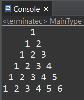
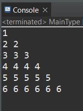
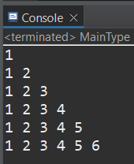
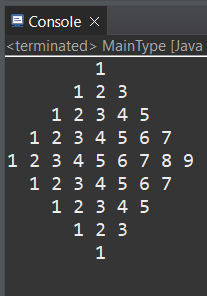
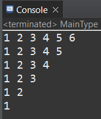
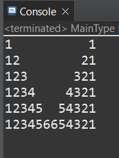
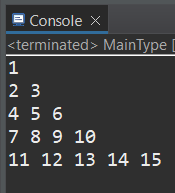
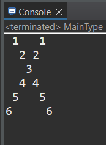
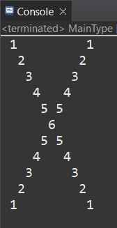

PROGRAM LIST AND OUTPUTS: 

   ### Program 1

   

* Link -> [Pattern pattern 1 program](https://github.com/smsatheesh/Basic_Coding_In_Javascript/blob/main/NumberPatterns/src/pattern_1.js)

  ### Program 2

  

* Link -> [Pattern pattern 2 program](https://github.com/smsatheesh/Basic_Coding_In_Javascript/blob/main/NumberPatterns/src/pattern_2.js)

  ### Program 3

  

* Link -> [Pattern pattern 3 program](https://github.com/smsatheesh/Basic_Coding_In_Javascript/blob/main/NumberPatterns/src/pattern_3.js)

  ### Program 4

  

* Link -> [Pattern pattern 4 program](https://github.com/smsatheesh/Basic_Coding_In_Javascript/blob/main/NumberPatterns/src/pattern_4.js)

  ### Program 5

  

* Link -> [Pattern pattern 5 program](https://github.com/smsatheesh/Basic_Coding_In_Javascript/blob/main/NumberPatterns/src/pattern_5.js)

  ### Program 6
  
  

* Link -> [Pattern pattern 6 program](https://github.com/smsatheesh/Basic_Coding_In_Javascript/blob/main/NumberPatterns/src/pattern_6.js)

  ### Program 7

  

* Link -> [Pattern pattern 7 program](https://github.com/smsatheesh/Basic_Coding_In_Javascript/blob/main/NumberPatterns/src/pattern_7.js)

  ### Program 8

  

* Link -> [Pattern pattern 8 program](https://github.com/smsatheesh/Basic_Coding_In_Javascript/blob/main/NumberPatterns/src/pattern_8.js)

  ### Program 9

  

* Link -> [Pattern pattern 9 program](https://github.com/smsatheesh/Basic_Coding_In_Javascript/blob/main/NumberPatterns/src/pattern_9.js)

